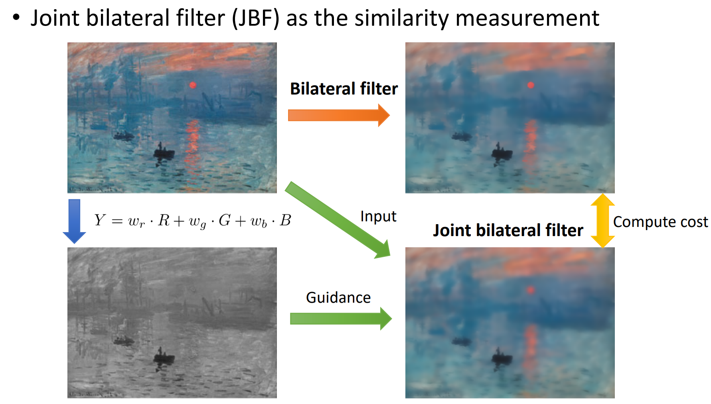
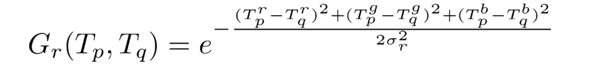
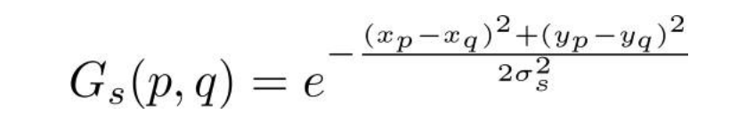

# 2019EE_CV 
[couse website link](http://media.ee.ntu.edu.tw/courses/cv/19F/)

### HW1: Joint Bilateral Filter

[slide](http://media.ee.ntu.edu.tw/courses/cv/19F/hw/hw1/hw1.pdf)

1. find a better conversion with bilateral filter and Joint-bilateral filter
2. compute cost between
3. get the best conversion where the guidance leads to minimum cost

- concept

- range kernel

- spatial kernel 

### HW2: Basic CNN

### HW3: Homography transformation

### HW4: Stereo Matching 

### Final project: Stereo Matching(PSMNet)